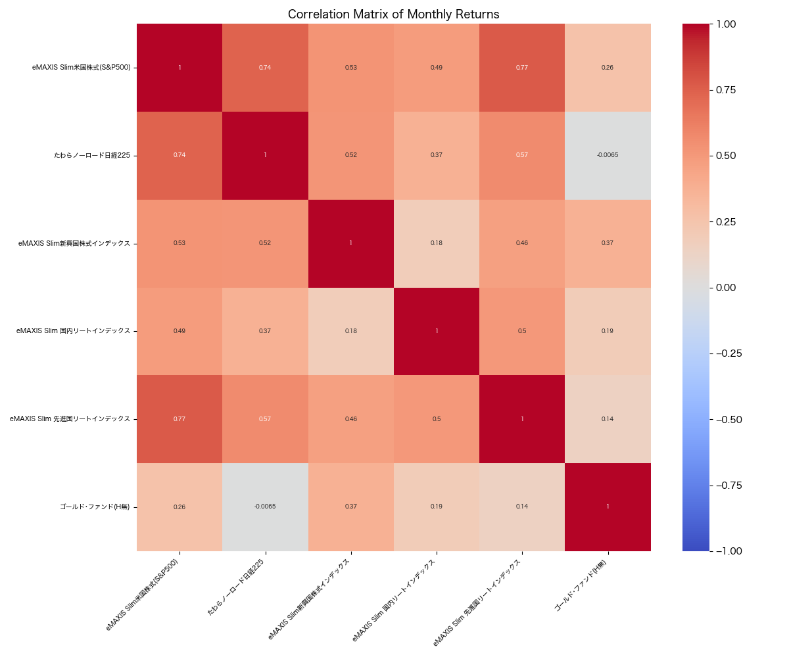
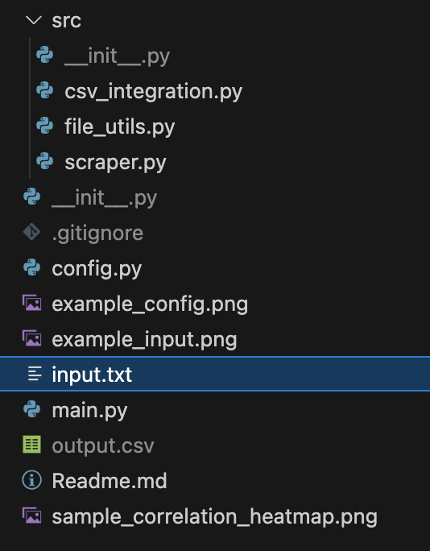
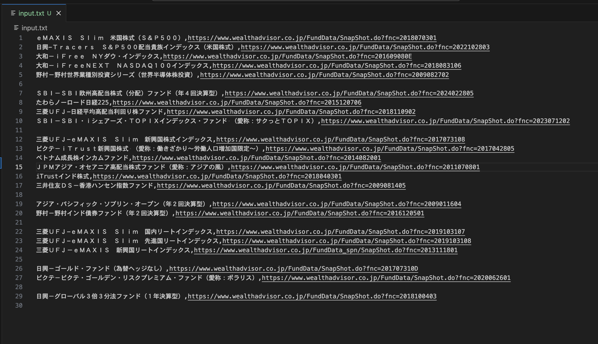
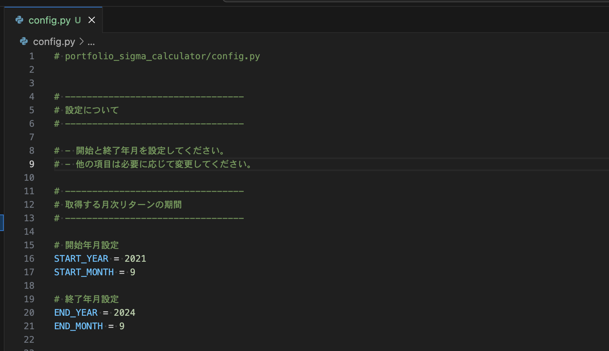

# ポートフォリオの相関分析　

## TODO
- ポートフォリオの標準偏差を計算する機能

## 　使い方 

- パソコンのお好きな場所にダウンロードして、ディレクトリに移動してください。 

- `input.csv`ファイルを開いて、`名称,wealthadvisorの銘柄ページのURL`の順で編集してください。 
  - 例:ｅＭＡＸＩＳ　Ｓｌｉｍ　米国株式（Ｓ＆Ｐ５００）,https://www.wealthadvisor.co.jp/FundData/SnapShot.do?fnc=2018070301

- config.pyファイルを開いて、月次データの開始年月と終了年月を指定してください。

- 準備ができたら`Python main.py`や`Python3 main.py`などで実行ください。 